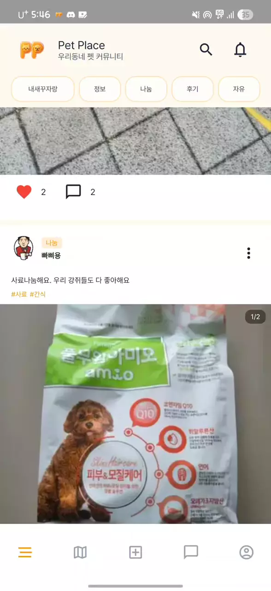

# PetPlace
### 우리동네 펫 커뮤니티 

---

# 프로젝트 개요
{width=800 height=430}
{width=800 height=430}
{width=800 height=430}
{width=800 height=430}
{width=800 height=430}
{width=800 height=430}
{width=800 height=430}
{width=800 height=430}
{width=800 height=430}
{width=800 height=430}
{width=800 height=430}
{width=800 height=430}

# 스플래쉬 화면
{height=430}

# 피드 페이지
- TopHeader의 부드러운 숨김처리 구현
- 피드 5개씩 페이지네이션 구현
- 글 작성 화면 구현 
- 개인 추천 알고리즘 적용  
- 좋아요, 댓글 FCM 알람 연동 

{height=430}
{height=430}
{width=200}

# 우리동네 페이지
- 바텀시트 구현
- 카카오맵 API 연동하여 위치 마커 표시

{height=430}

# 산책/돌봄 페이지
- 게시판 리스트 구현 
- 글 작성 화면 구현

{height=430}
{height=430}

# 실종 신고/등록 페이지 
- 실종신고 페이지 구현(잃어버렸어요)
- 실종등록 페이지 구현(목격했어요)
- 실종매칭 FCM 알람 연동 

{height=430}
{height=430}
{height=430}

# 채팅페이지
{height=430}

# 마이페이지
- 꼬순내 로직 구현
- 마이 프로필 수정 
- 내 가족(펫) 등록 및 추가 
- 신뢰기반 내 용품 등록 구현
- 마이피드, 댓글, 찜한피드 조회 구현

{height=430}
{height=430}

# 영상포트폴리오
[{width=800 height=430}](https://www.youtube.com/watch?v=vrb4LYhehxQ)

# 시스템 아키텍처

# Role
|오승연|김민|조경호|
|:---:|:---:|:---:|
|모바일|백엔드|인프라, AI|
|[{width=150 height=150}](https://github.com/syeony)|[{width=150 height=150}](https://github.com/ZeppIine)|[{width=150 height=150}](https://github.com/Alien-kh)

|이도형|송정현|정유진|
|:---:|:---:|:---:|
|모바일|모바일|백엔드|
|{width=150 height=150}|{width=150 height=150}|{width=150 height=150}|

# 상세 역할분담

- 오승연: 디자인, 피드, 글쓰기, 댓글, 산책/돌봄, 실종 페이지 및 기능 연결

- 김민: 피드, 댓글, 좋아요, 마이페이지, 펫, 꼬순내, FCM 기능 구현 및 DB 설계

- 조경호: AI 모델 연구 및 최적화, 빅데이터 추천 로직 구현, 인프라 구축, 채팅 기능 구현

- 이도형: 로그인, 소셜로그인, 호텔 페이지 기능 연결, 카카오맵 API 연결, 온디바이스 AI 적용

- 송정현: 채팅, 마이페이지, 펫 페이지 기능 연결, FCM 딥링크 구현

- 정유진: 디자인, 로그인, JWT, 호텔, 산책/돌봄 기능 구현 및 DB 설계
